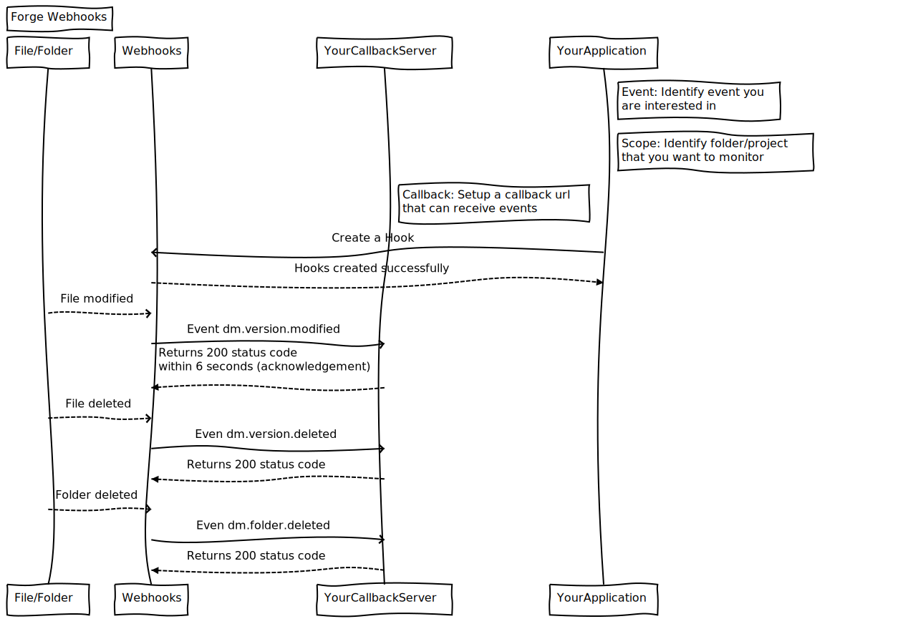

## [Forge Webhooks FAQ](https://scratch-forge.github.io/webhooks-faq/)

Information on Autodesk Forge Webhooks. Official documentation is [here](https://developer.autodesk.com/en/docs/webhooks/v1)

### What is Webhook?

In simplest language, it is a way to communicate to other application when an event occurs.

Let's take a real life example: Imagine that you're interested in reading book of _Science fiction_ genre. These books are available in your nearest library. You want to read the new book in _Science fiction_ genre as soon as it becomes available in library.

Here are your options:

1. *Polling*: You need to visit library frequently to find out if there is any new book in _Science fiction_ genre. This option definitely doesn't sound interesting. Certainly wastage of effort and time for you and librarian.

2. *Webhooks*: You provide your phone number (or, Callback URL) and, register your interest in _Science fiction_ genre (or, event of interest) with Library administrator (or, Forge Webhooks service). So that, when a new book arrives in genre of your interest, you can get notification on your phone (event information on Callback). After receiving the event, you can take action such as visit the library to borrow the book.

### What are the scenarios where I should use Webhooks?

* If your application is polling Forge Data Management APIs regularly and frequently to determine if there are any changes in Files or Folders.
* If you want to determine if a file/folder is added, deleted, modified, or renamed.

To detect such changes, you must use Webhooks.

### How does the whole system works?

See below 

### Is there any tutorial?

Autodesk folks have created a very nice and intuitive tutorial at: https://developer.autodesk.com/en/docs/webhooks/v1/tutorials/ Please take a look.

### What are the type of events on which my application can create hook?

You can find list of all type of events at [https://developer.autodesk.com/en/docs/webhooks/v1/overview/webhooks-events/](https://developer.autodesk.com/en/docs/webhooks/v1/overview/webhooks-events/)

### How to ensure security of callback payload? Or, how to ensure that callback is being invoked from a valid source (in this case, Autodesk Webhooks service)?

* Set a Token of your choice using [POST /tokens](https://developer.autodesk.com/en/docs/webhooks/v1/reference/http/tokens-POST/)
* Use this Token to validate the payload: [Verify Payload Signature](https://developer.autodesk.com/en/docs/webhooks/v1/tutorials/how-to-verify-payload-signature/).

### Can I create a webhook which invokes callback URL for "all" the events?

Yes, you can create a webhook to listen on all the Data-Management events. You can use [POST systems/:system/hooks](https://developer.autodesk.com/en/docs/webhooks/v1/reference/http/systems-system-hooks-POST/) API for creating a webhook which would listen for all the events.

### Can I create a webhook which invokes callback URL for "a specific event"?

You can create a webhook to listen to a specific Data-Management event. You can use [POST systems/:system/events/:event/hooks](https://developer.autodesk.com/en/docs/webhooks/v1/reference/http/systems-system-events-event-hooks-POST/).

### Can I retrieve list of all the webhooks created by my application?

You can retrieve lists of all the hooks by calling [GET systems/:system/hooks](https://developer.autodesk.com/en/docs/webhooks/v1/tutorials/retrieve-list-of-hooks/)

### Can I retrieve list of all the webhooks created by my application for a specific event?

You can retrieve lists of hooks by calling [GET systems/:system/events/:event/hooks](https://developer.autodesk.com/en/docs/webhooks/v1/reference/http/systems-system-events-event-hooks-GET/)

### Can I retrieve completel details of a webhooks created by my application?

You can retrieve details of a webhook by calling [GET systems/:system/events/:event/hooks/:hook_id](https://developer.autodesk.com/en/docs/webhooks/v1/reference/http/systems-system-events-event-hooks-hook_id-GET/)

### I would like to delete one of the webhook created. How should I do it?

Please see tutorial section [Delete a Webhook](https://developer.autodesk.com/en/docs/webhooks/v1/tutorials/delete-a-hook/)

### Is there any sample app?

I found one at: [Autodesk-Forge/data.management-nodejs-webhook](https://github.com/Autodesk-Forge/data.management-nodejs-webhook)

You can also find related information at [blog](https://forge.autodesk.com/blog/webhooks-data-management-api-nodejs-sample)

### Where can I get additional help of Forge Webhooks?

https://stackoverflow.com/questions/tagged/autodesk-webhooks
