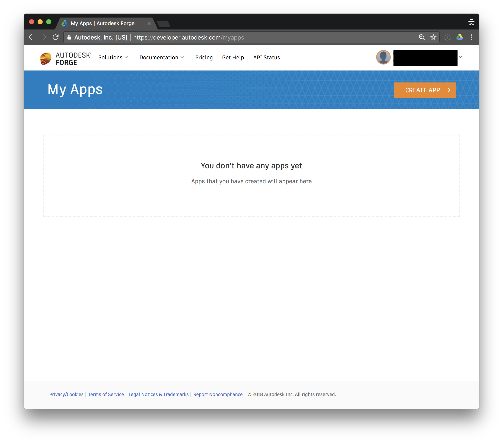
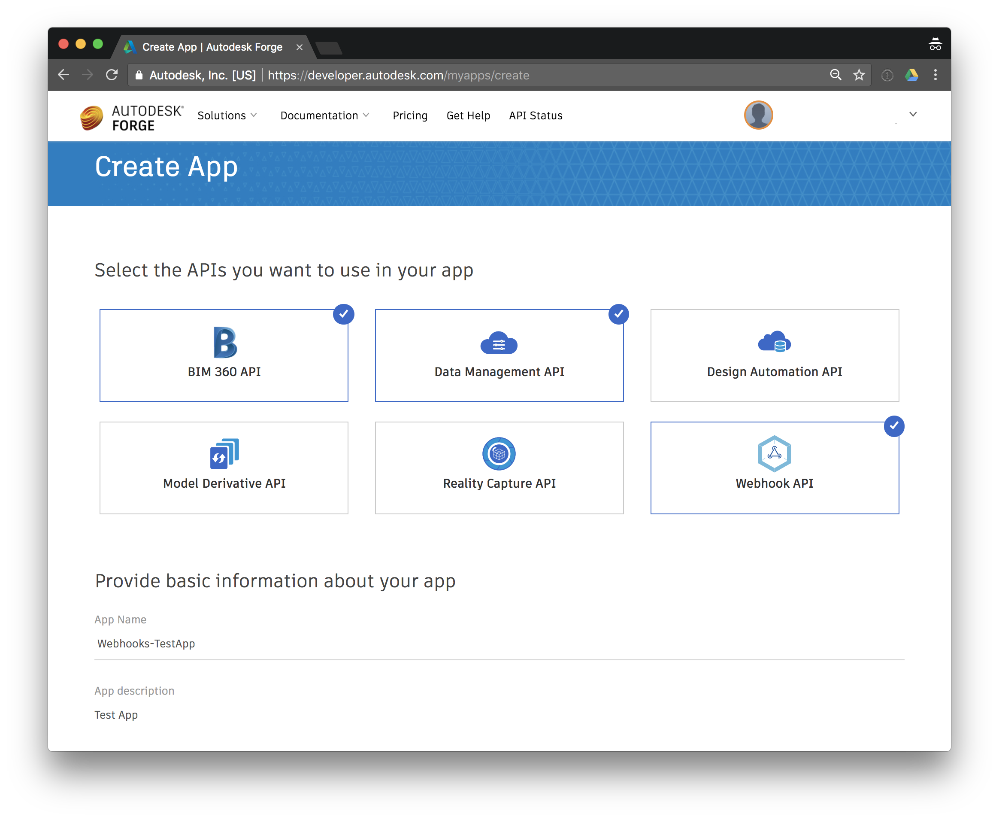
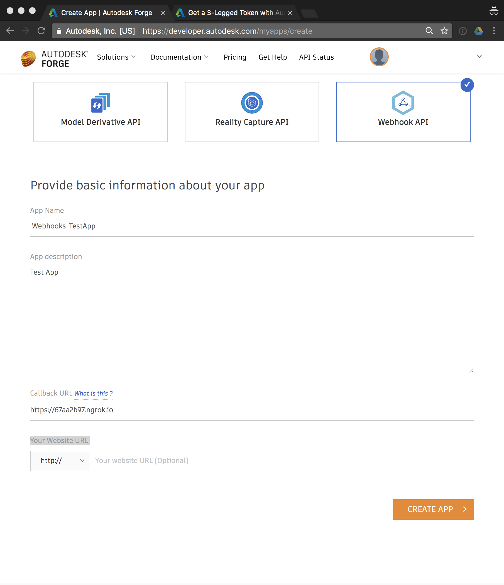
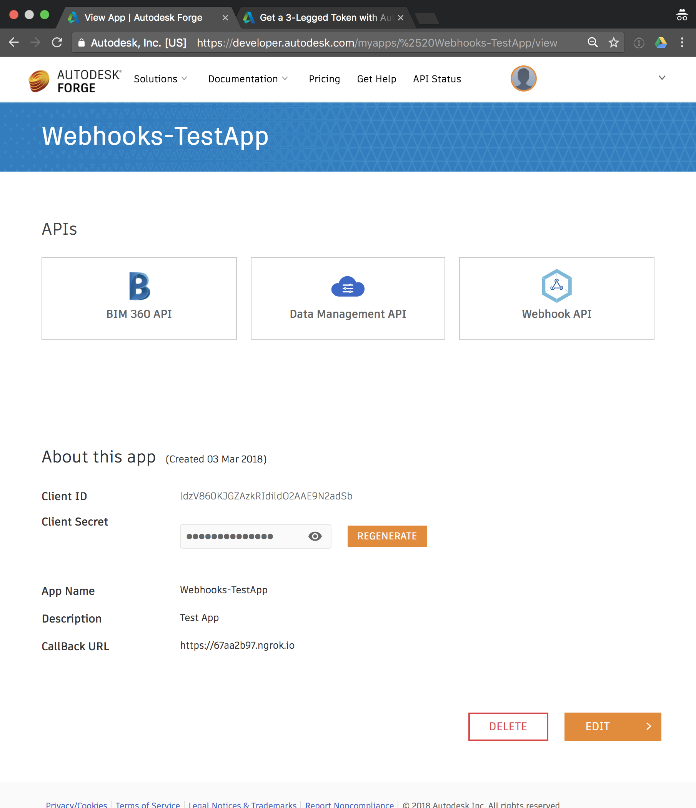

## Create An App

### Steps

* Go to Autodesk [Forge Platform](https://developer.autodesk.com/) and [Sign In](https://accounts.autodesk.com/Authentication/LogOn)
* Go back to [Forge Platform](https://developer.autodesk.com/) after Sign In if it is not redirected automatically
* Create a Forge App using [Create App](https://developer.autodesk.com/myapps)

..* If you want to access Webhooks API, don't forget to select **Webhook API** (and, Data Management API since you will be listening to events coming from file/folder/project operations)

..* Provide a `App Name` such as `Webhooks-TestApp` for your Forge App
..* Provide App description (Optional)
..* Set a `Callback URL`. This Callback URL is used for [3-legged](https://developer.autodesk.com/en/docs/oauth/v2/tutorials/get-3-legged-token/) Authentication fLow. And, this callback URL is different from Webhooks callback URL we will be registering later.
..* If you have already a working server which can receive 3-legged Authentication Token then you can move onto the next step. You can setup  [ngrok](https://ngrok.com) test server if you dont have a server ready yet. Please see **Setup ngrok server for Callback URL** section for detailed steps.
..* Provide callback URL in `Callback URL` field. If you are using ngrok, copy and paste the `Forwarding` URL

..* Please leave `Your Website URL` empty for this example since its an optional field.
..* Click on **CREATE APP**. Just now, you successfully created a Forge App.
..* You will notice `Client ID` and `Client Secret` for your App. We will use it later for accessing Webhooks and other Forge APIs.
   


### Setup ngrok server for Callback URL

* Download [ngrok](https://ngrok.com/download)

* Start ngrok with command: `./ngrok http 5678` See ngrok documentation for more information on ngrok commands. You should see something similar to:
```sh
ngrok by @inconshreveable                                    

Session Status                online                                          
Session Expires               7 hours, 59 minutes                             
Version                       2.2.8                                           
Region                        United States (us)                              
Web Interface                 http://127.0.0.1:4040                           
Forwarding                    http://67aa2b97.ngrok.io -> localhost:5678      
Forwarding                    https://67aa2b97.ngrok.io -> localhost:5678     

Connections                   ttl     opn     rt1     rt5     p50     p90     
                              0       0       0.00    0.00    0.00    0.00
```

* You can monitor incoming-traffic in browser by accessing [Web Interface](http://127.0.0.1:4040)
