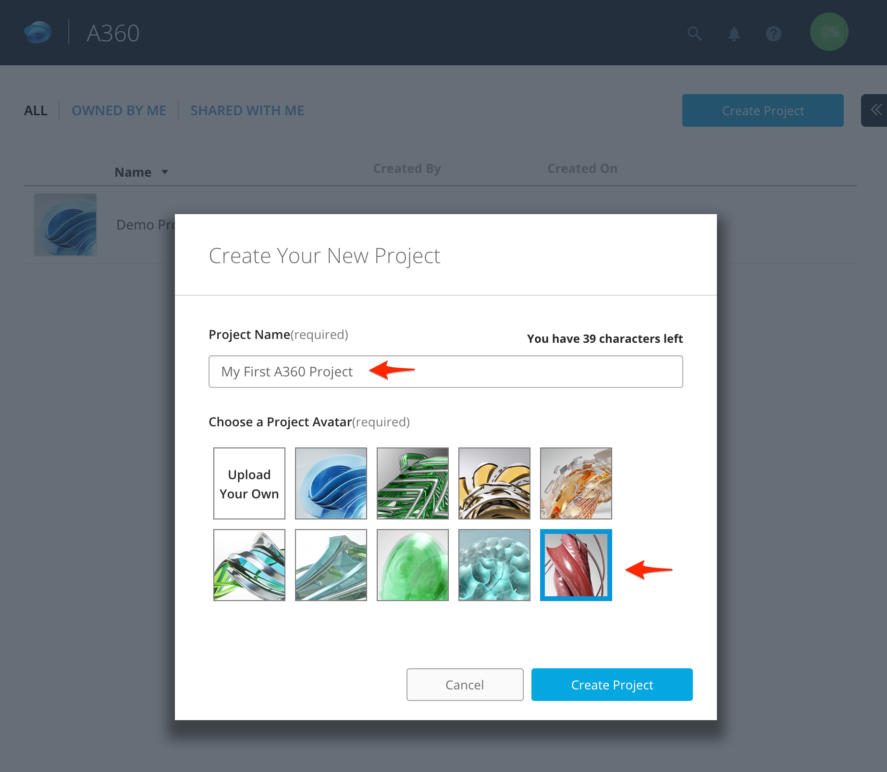

## Create a Hub and Projects

### Steps

We will start with [A360](https://a360.autodesk.com/) Hub and Projects. However, some of the information mentioned here is also applicable to [BIM 360](https://bim360.autodesk.com/).

* Go to Autodesk [A360](https://a360.autodesk.com/) and [Sign In](https://login.autodesk360.com/login)
* Go back to your A360 [myhub](https://myhub.autodesk360.com) after Sign In if it is not redirected automatically
* You should see an already created project **Demo Project**.

* A new A360 Project can be created under a Hub using **Create Project** button.
* Click on button **Create Project**

  * Enter a project name in `Project Name` field. For ex. `My First A360 Project`
  * Select an Avatar for your Project.
  * Click **Create Project** button. It should create a project with same name as provided earlier.
  
  * You can add Design Files or create a Folder by using **New** or **Upload** buttons.
  
  
  * Add few design files or files such as images, documents etc. For ex. I added *webhook.svg* file
  
